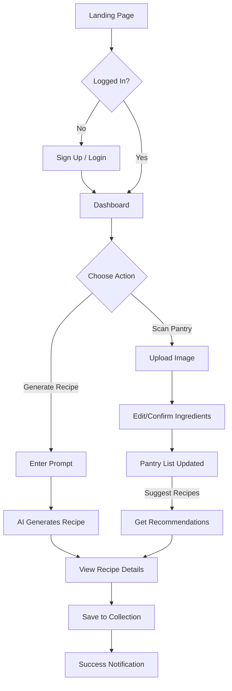
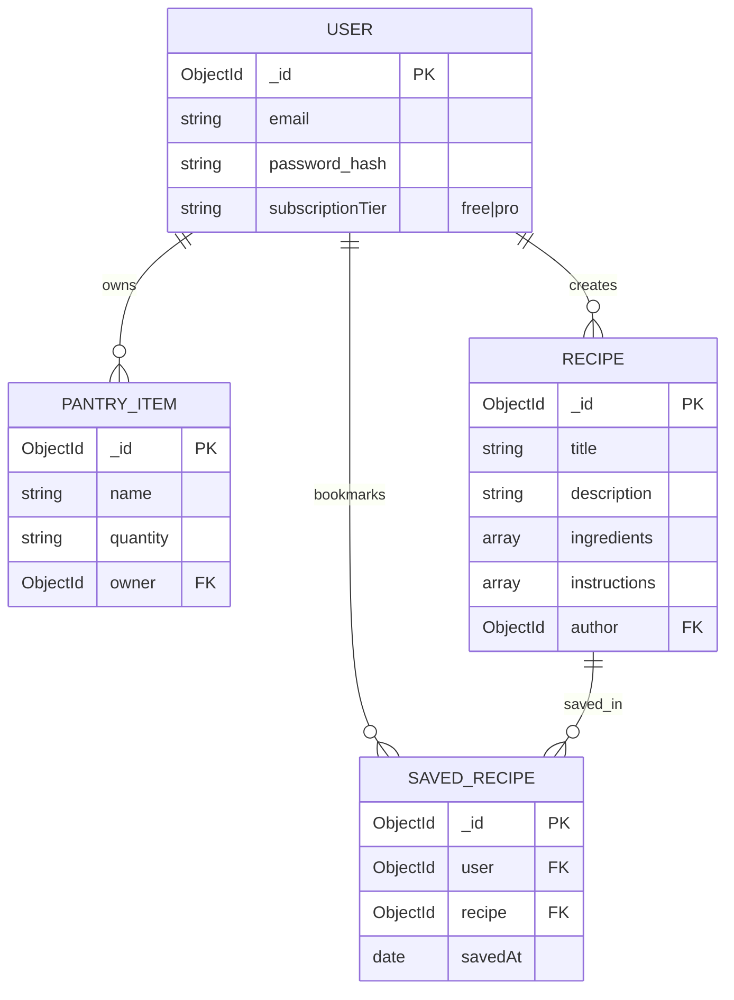

# Project Name: Servd AI Recipe Platform

> An intelligent culinary assistant that turns your pantry ingredients into professional recipes using Google Gemini AI.

---

## 🚀 Features

- **AI Pantry Scanner**: Snap a photo of your fridge or pantry, and the system uses Gemini Vision (AI) to identify and list every ingredient automatically.
- **Smart Recipe Generation**: Describe what you're craving (e.g., "high protein breakfast"), and the AI generates a complete recipe with ingredients, instructions, and nutritional info.
- **"Cook With What You Have"**: Based on your scanned pantry items, the system suggests 5 unique recipes you can cook _right now_ without buying extra groceries.
- **Dynamic Image Sourcing**: Every generated recipe automatically fetches a high-quality, relevant image from Unsplash.
- **Recipe Collections**: Save your favorite generated recipes to your personal collection for quick access later.

---

## 🔄 User Flow

The following diagram illustrates the path a user takes from landing on the site to saving a recipe.

---

## 🏗️ Data Flow

This section describes how data moves from the Client to the Database in our "Thin Client, Heavy Backend" architecture.

1.  **Client Tier**: User interacts with the Next.js UI (e.g., clicks "Generate").
2.  **API Tier**: The Frontend Server Action uses `fetchWithAuth()` to send a secure request to the Express Backend.
3.  **Auth Layer**: Backend `auth` middleware verifies the HTTP-Only JWT Cookie. `rateLimit` middleware checks Arcjet limits.
4.  **Service Layer**: The Controller calls `lib/ai` services to interact with Google Gemini and Unsplash.
5.  **Data Tier**: The final Recipe or Pantry Item is validated via Mongoose and persisted to MongoDB.

---

## 🗄️ Database Schema

Below is the entity-relationship structure for the project.

### Table Definitions

| Table           | Column             | Type     | Description                                     |
| :-------------- | :----------------- | :------- | :---------------------------------------------- |
| **Users**       | `_id`              | ObjectId | Unique identifier for the user.                 |
|                 | `email`            | String   | Unique email address for login.                 |
|                 | `password`         | String   | Bcrypt-hashed password.                         |
|                 | `subscriptionTier` | String   | 'free' or 'pro'. Determines Arcjet rate limits. |
| **Recipes**     | `_id`              | ObjectId | Unique identifier for the recipe.               |
|                 | `title`            | String   | The name of the dish.                           |
|                 | `ingredients`      | Array    | List of objects `{ name, amount }`.             |
|                 | `author`           | ObjectId | Reference to the User who generated it.         |
| **PantryItems** | `_id`              | ObjectId | Unique identifier for the item.                 |
|                 | `name`             | String   | Name of the ingredient (e.g., "Eggs").          |
|                 | `owner`            | ObjectId | Reference to the User who owns this item.       |

---

## 🛠️ Tech Stack

- **Frontend**: Next.js 16 (App Router), Tailwind CSS v4, Lucide React, Shadcn/UI
- **Backend**: Node.js, Express.js 5, JavaScript (Modules)
- **Database**: MongoDB, Mongoose ODM
- **AI & Media**: Google Gemini 1.5 Flash, Unsplash API
- **Security**: Arcjet (WAF & Rate Limiting), JWT Auth, Bcrypt
