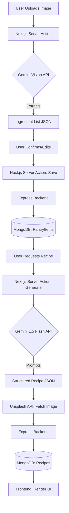

# Project Topology & Data Flow: Servd AI Recipe Platform

This document serves as the master map for the project's physical structure and its logical data pathways.

---

## 1. Complete File Structure

Below is the full recursive structure of the project (excluding `node_modules`, `.next`, and build artifacts).

```text
ai-recipe-platform-master/
├── backend-manual/
│   ├── middleware/
│   │   └── auth.js             # JWT Verification logic
│   ├── models/
│   │   ├── PantryItem.js       # Mongoose Schema: User ingredients
│   │   ├── Recipe.js           # Mongoose Schema: AI Generated Recipes
│   │   ├── SavedRecipe.js      # Mongoose Schema: User bookmarks
│   │   └── User.js             # Mongoose Schema: Auth & Profile
│   ├── routes/
│   │   ├── auth.js             # Endpoints: Login, Signup, Logout
│   │   ├── pantry.js           # Endpoints: Pantry CRUD
│   │   ├── recipes.js          # Endpoints: Recipe search & creation
│   │   ├── saved-recipes.js    # Endpoints: User collections
│   │   └── users.js            # Endpoints: Profile management
│   ├── package.json
│   └── server.js               # Entry: DB Connection & Server Config
├── doc/
│   ├── ARCHITECTURE_AND_DESIGN.md
│   ├── INTERVIEW_QA_HINGLISH.md
│   ├── PROJECT_STRUCTURE_AND_FLOW.md
│   ├── SETUP_AND_REBUILD_GUIDE.md
│   └── stacks.md
├── frontend/
│   ├── actions/
│   │   ├── mealdb.actions.js   # External API integration logic
│   │   ├── pantry.actions.js   # Gemini Vision & Pantry Sync
│   │   └── recipe.actions.js   # Gemini Text Generation & Storage
│   ├── app/
│   │   ├── (auth)/             # Auth Route Group
│   │   │   ├── sign-in/
│   │   │   └── sign-up/
│   │   ├── (main)/             # Core Feature Group
│   │   │   ├── dashboard/      # User Home
│   │   │   ├── pantry/         # Ingredient Management
│   │   │   ├── recipe/         # Recipe View/Generator
│   │   │   └── recipes/        # Saved/Public Recipes
│   │   ├── admin/              # Administrative Dashboard
│   │   ├── globals.css         # Tailwind Root
│   │   ├── layout.js           # Root Layout & Auth Provider
│   │   └── page.js             # Landing Page
│   ├── components/
│   │   ├── ui/                 # shadcn/ui components (Radix + Tailwind)
│   │   ├── wrappers/           # Layout Context Wrappers
│   │   ├── Header.js           # Main Navigation
│   │   └── PricingSection.js   # Subscription UI
│   ├── lib/
│   │   ├── ai/                 # Modular AI Layer
│   │   │   ├── client.js       # Shared Gemini initialization
│   │   │   ├── image-service.js# Unsplash integration
│   │   │   └── prompts.js      # Clean storage for AI prompts
│   │   ├── arcjet.js           # Security & Rate Limits
│   │   ├── auth-context.js     # React Auth Context (Auth State)
│   │   ├── data.js             # Static configuration data
│   │   └── serverAuth.js       # Server-side auth helpers
│   ├── middleware.js           # Next.js Auth & Arcjet Middleare
│   ├── next.config.mjs
│   └── package.json
└── README.md
```

---

## 2. Core Data Flow Logic

### 🔄 Scenario: Pantry Scanning to Recipe Generation

The platform uses a "Hybrid Server-Sync" model where the frontend server orchestrates AI and the backend persists data.



---

## 3. Communication Patterns

### **1. Authentication (JWT)**

- **Issuance**: Backend `POST /api/auth/login` sets a Secure, HttpOnly cookie named `token`.
- **Validation**: Every frontend request to the backend includes `credentials: 'include'`, which the Express `auth` middleware validates before processing logic.

### **2. AI Security (Server Actions)**

- **Isolation**: All AI calls (`@google/generative-ai`) are strictly in `frontend/actions/`, but the heavy logic is abstracted into `frontend/lib/ai/`. This "Double Layer" isolation prevents the `GEMINI_API_KEY` from leaking and keeps action files readable.
- **Rate Limiting**: **Arcjet** check logic is integrated directly inside the Server Actions to prevent API abuse before the call is even made.

### **3. Data Synchronization**

- **Manual Backend Strategy**: Instead of using a complex CMS, the Express backend serves as a clean, predictable API that handles JSON objects wrapped in a `data` envelope, ensuring parity with frontend data expectations.
